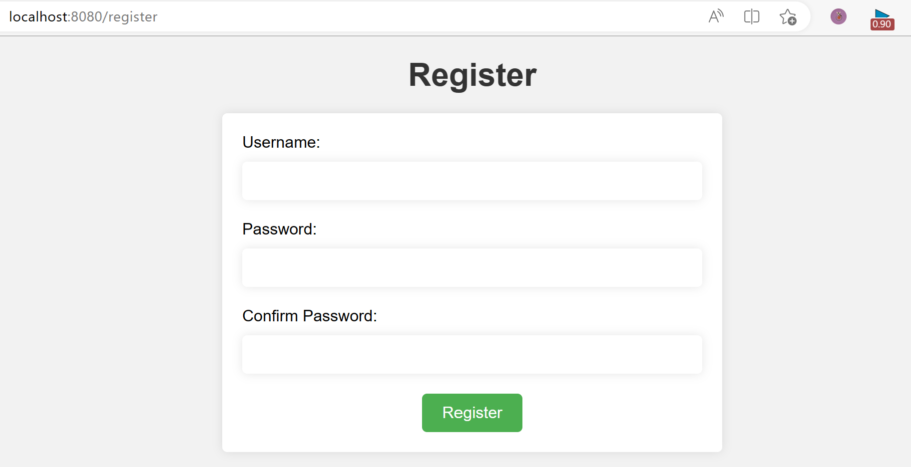

## web 聊天室程序
这是一个基于 Gin 框架和 WebSocket 实现的简单聊天室应用程序。它使用了 MySQL 数据库保存用户信息和聊天记录，并使用 Gorilla WebSocket 库实现了 WebSocket 通信。


### 主要功能：

* 用户注册和登录
* 用户通过 WebSocket 连接到聊天室
* 实时消息广播给所有在线用户
* 用户在聊天室中发送消息
* 聊天室主页面，展示所有在线用户
* 保存聊天记录到 MySQL 数据库
* 离线消息读取
* 错误处理和日志记录
* 安全防范措施，如防止跨站脚本攻击和 SQL 注入攻击
 

### 代码结构

* 定义了全局变量，包括 WebSocket 连接映射、消息结构体（包含发送者和消息内容）以及消息通道。
* 在 `main()` 函数中，首先建立数据库连接并测试连接。接着，配置了 Gin 路由以处理登录、注册和聊天页面的请求。定义了处理 WebSocket 连接的 `wshandler()` 函数，用于处理客户端发送的消息并广播到所有在线用户。
* 定义了 `sendUserList()` 函数，用于获取在线用户列表并发送给所有连接的客户端。
* 在 `main()` 函数中启动了一个协程，用于从全局消息通道中读取消息并将消息保存到数据库以及广播给所有在线用户。
* 最后，运行 Gin 路由，监听 8080 端口。


### 改进方向
增加错误处理、日志记录、安全性方面的改进等。此外，密码的存储应使用加密方法（如 bcrypt 等）以保证安全性。


### 目录结构
``` arduino
.
├── main.go
├── static
│   ├── css
│   │   └── ...
│   ├── images
│   │   └── avator.png
│   └── js
│       └── ...
└── templates
├── chat.html
├── index.html
├── login.html
└── register.html
```


### 教程
#### 将代码克隆到本地
```
git clone git@github.com:ElandWoo/chatroom.git
```

##### 安装必要的依赖项

代码使用了以下Go包：

* github.com/gin-gonic/gin
* github.com/go-sql-driver/mysql
* github.com/gorilla/websocket

使用go get命令安装这些包，例如：

``` go 
go get -u github.com/gin-gonic/gin
go get -u github.com/go-sql-driver/mysql
go get -u github.com/gorilla/websocket
```

##### 数据库配置
确保您的MySQL数据库已设置并运行。
建立chatroom数据库
``` sql
CREATE DATABASE chatroom;
```
并在其中创建users和messages表:
``` sql
USE chatroom;
CREATE TABLE users (
    id INT AUTO_INCREMENT PRIMARY KEY,
    username VARCHAR(255) UNIQUE NOT NULL,
    password VARCHAR(255) NOT NULL
);

CREATE TABLE messages (
    id INT AUTO_INCREMENT PRIMARY KEY,
    sender VARCHAR(255) NOT NULL,
    message TEXT NOT NULL,
    created_at TIMESTAMP DEFAULT CURRENT_TIMESTAMP
);


USE chatroom;
SHOW TABLES;
SELECT * FROM users;
SELECT * FROM messages;
```

将main.go:39行配置成自己的mysql数据库
``` go
db, err := sql.Open("mysql", "user:password@tcp(username:port)/chatroom")
```

#### 添加静态文件
如果你想在项目中添加自己的静态文件，确保你的静态文件（CSS、JavaScript、图片等）位于正确的目录中。
代码将静态文件目录设置为./static，你还需要确保模板文件位于名为templates的目录中。

#### 编译运行
1. 在浏览器中输入[http://localhost:8080](http://localhost:8080)查看是否正常启动；
   
2. 运行您的程序并尝试使用Web浏览器访问应用程序。首先访问[http://localhost:8080/register](http://localhost:8080/register), 尝试注册一个新用户；
   
3. 然后，访问[http://localhost:8080/register](http://localhost:8080/register), 尝试使用刚刚注册的用户登录。
   
   
4. 开始[聊天](http://localhost:8080/chat) 
   
   